# sisfo_penagihan

SISFO-PENAGIHAN v1.0 , Sistem Informasi Basis Web untuk Penagihan Client atas suatu langganan produk yang bersifat rutin bulanan.

Dibuat dan dites dengan WebServer XAMPP PHP 7.4 . Pada LinuxMint.

---

FITUR :

- Pendataan Paket Produk

- Pendataan User Pelanggan

- Pendataan Paket Produk yang Dipilih Pelanggan

- Pembayaran

- Jatuh Tempo

- Hutang Pelanggan

- Laporan per User

- Laporan per Tanggal

- Laporan per Bulan

- Laporan per Tahun

- Laporan per Jatuh Tempo

- Laporan per Paket Produk

- Laporan Peringkat Pelanggan

---

TAMPILAN / SKRINSUT :  

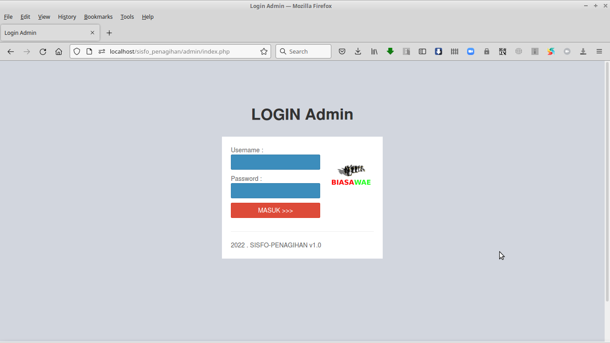 

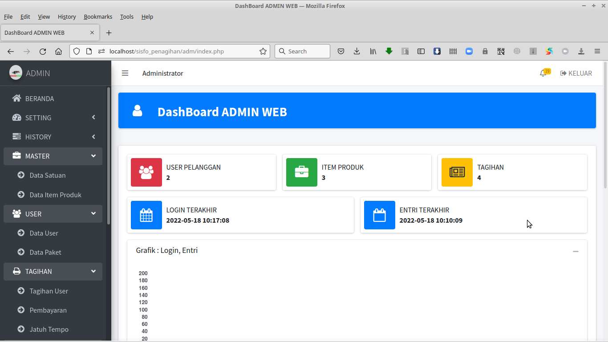 

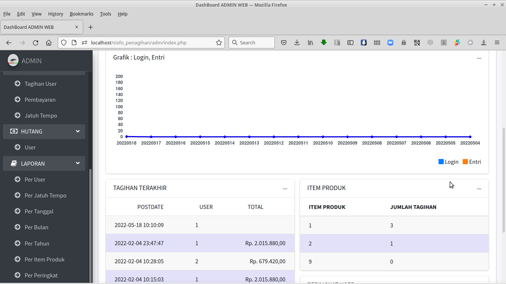 

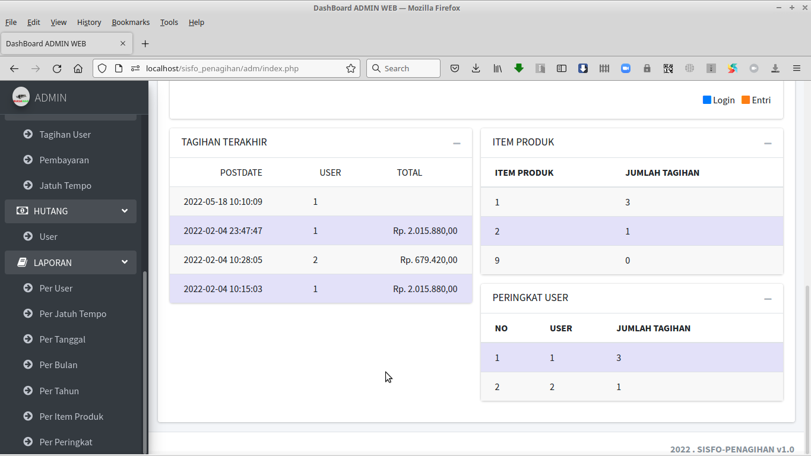 

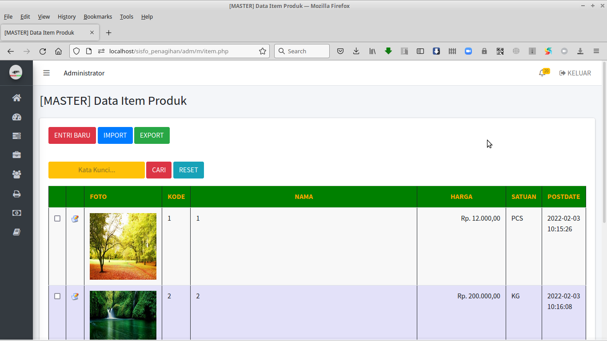 

 

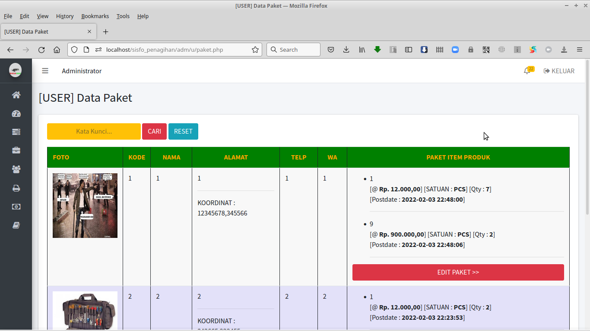 

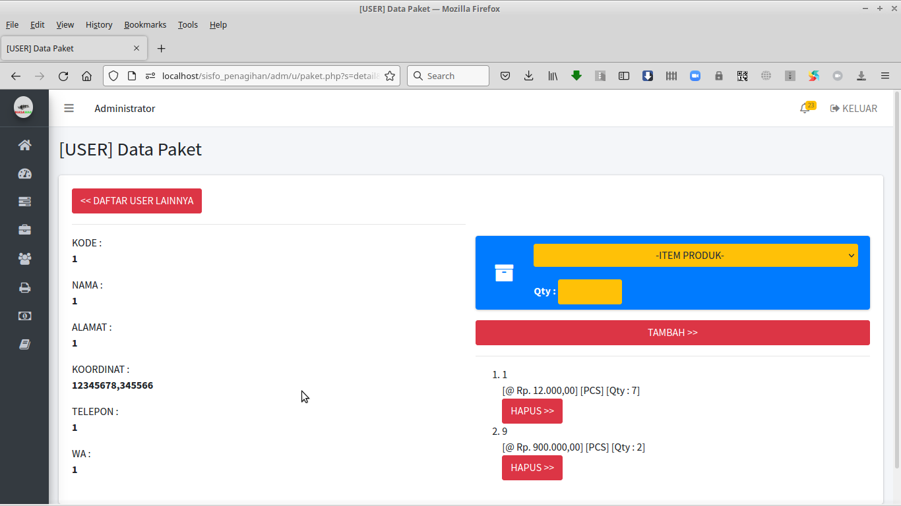 

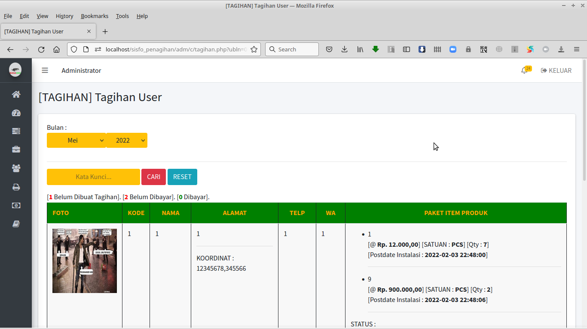 

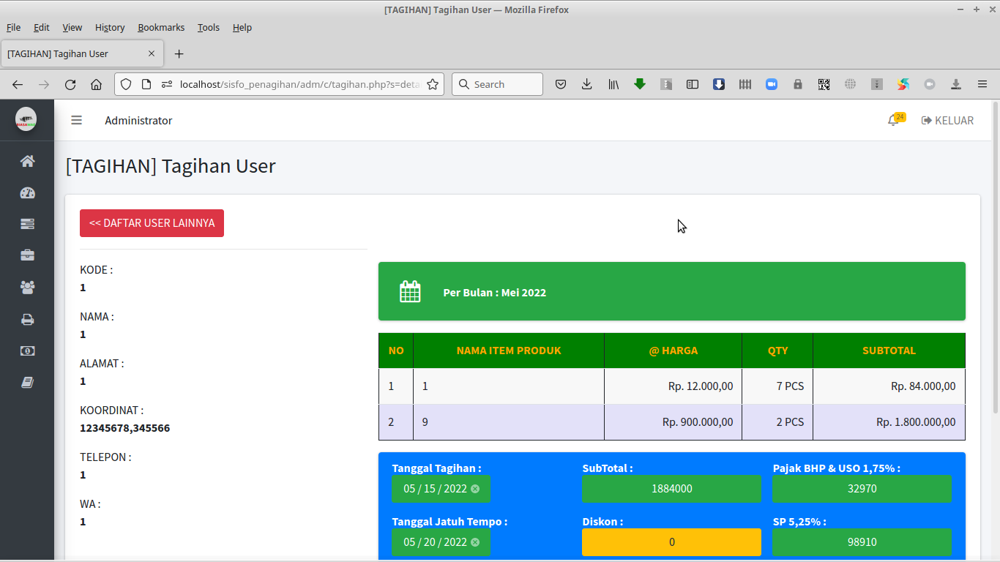 

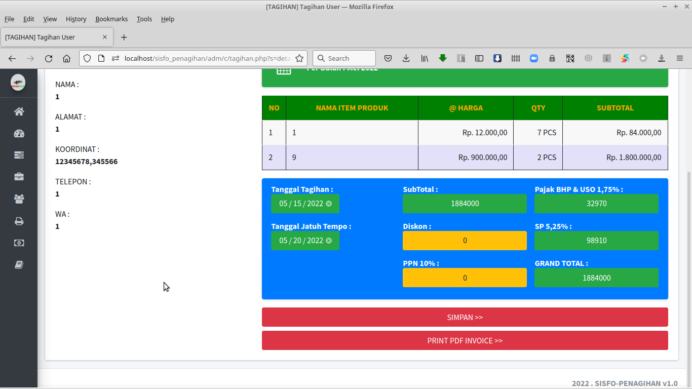 

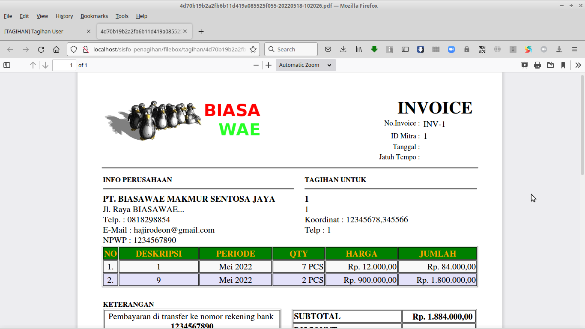 

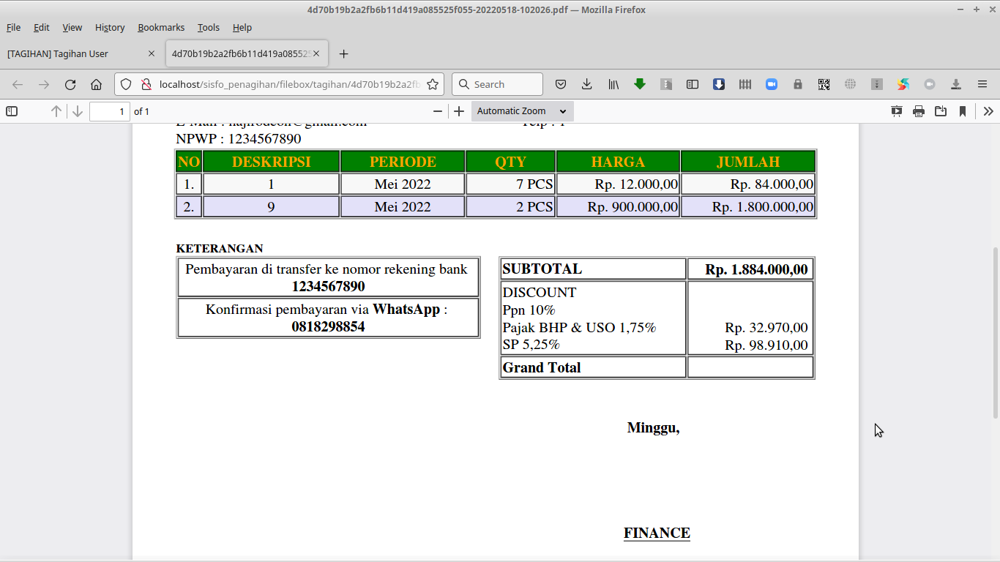 

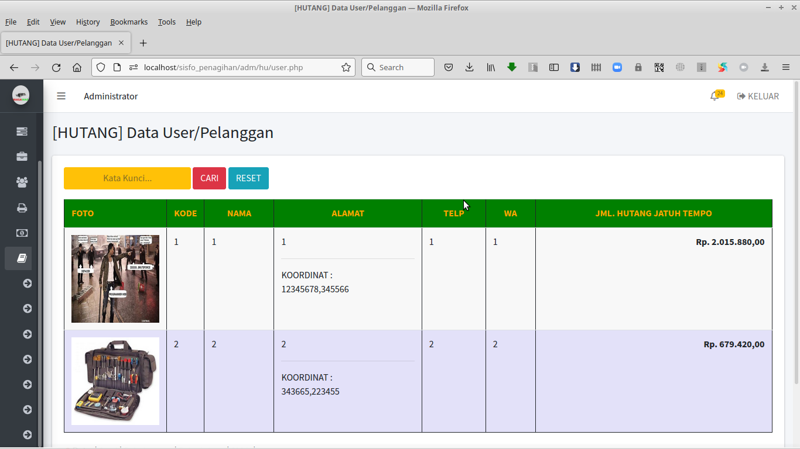 

---

INSTALASI DAN KONFIGURASI :  

1. Ekstrak file web ke folder web webserver www atau htdocs

2. Untuk konfigurasi, bisa set di file /inc/config.php

3. Jalankan phpmyadmin, buatlah sebuah database. dan lakukan import file database .sql, ada di folder /db

4. Jalankan SISFOPENAGIHAN sesuai alamat web yang ada.

---

AKSES ADMIN :

---

http://alamat_webnya

User/pass : admin

---

NB. 

DEMO ONLINE atau ingin request custom konten berbayar, silahkan bisa hubungi : 

hp/sms/wa : 081-829-88-54 

atau email : hajirodeon@gmail.com

